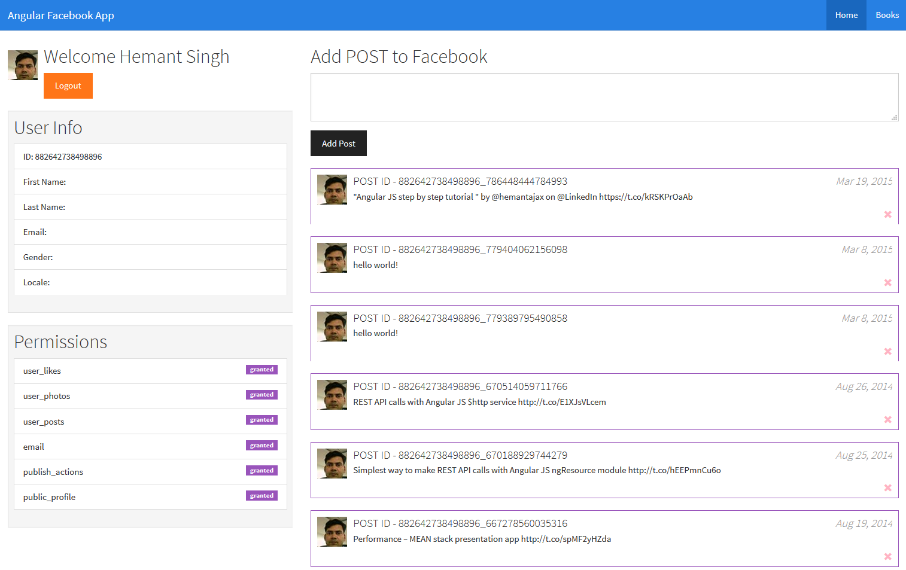

# Angular JS with facebook graph api

Demo - http://hesing.github.io/angular-facebook-app/public/#/home



## Run Application

```
node server.js
```

## Build
- clean build directory
- concatenation js & css
- copy extra stuff like fonts, images, favicon.ico to build directory
- css minification
- js minification
- image minification
- js code linting 
- watching js, css, html, less file changes
- code versioning
- Angular JS code annotation

```
grunt
```


